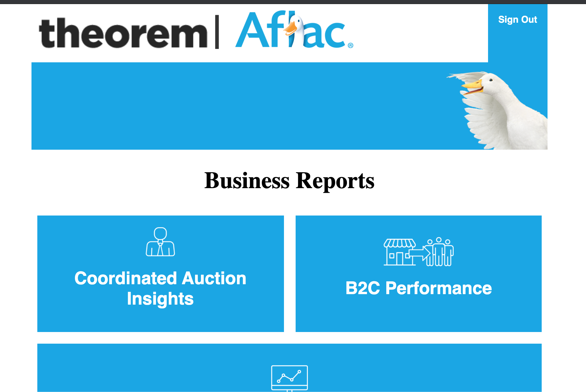
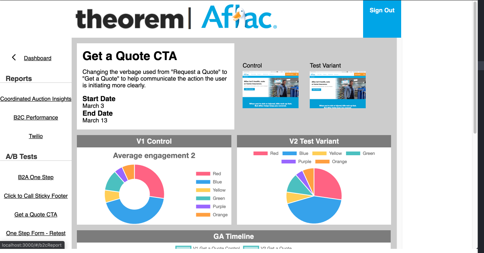
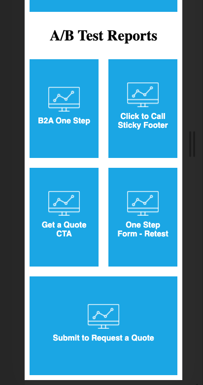
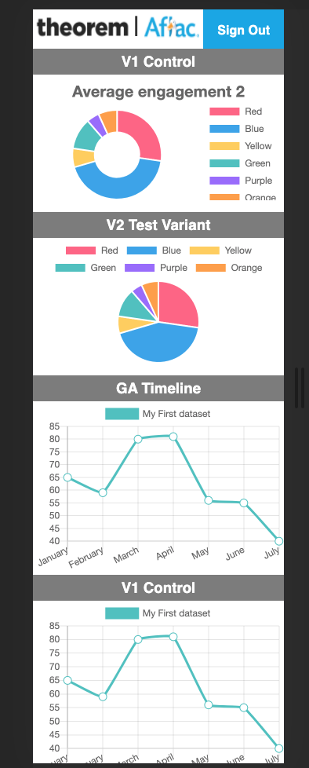

# _Aflac Dashboard_

## Branch Description

This branch is a combination of the FinalResponsiveStyles and majorRefactor branches. The app is fully responsive, and cross browser compatible. We have also added routing to the app.

We did not edit the content on any of the individual report pages, and the overall design may need some adjusting. As of now, each individual report page is symmetrical and looks ok regardless of screen size.

As you shrink down to mobile, all of the buttons on the splash page will fit to the screen and remain uniform. On an individual report page, each chart will re-format in a column layout. The navigation to get back to the dashboard lives at the bottom of an individual report view.

Note: The "B2A One Step" report doesn't have the same data as the others. It is an incomplete report. Also, we don't have the Power BI feed for the Business reports yet. To see a working model of a report, select any of the A/B Test Reports that aren't "B2A One Step".

## Screenshots










#### _This is an application for viewing analysis reports._
---
## Setup/Installation for a local environment

$ git clone

_(change directory into app of project )_

$ npm install

$ npm run start (browser will open to localhost:3000)  

---
## Adding a new business report

1. Open project in your ide.

2. Open app/src/constants/masterBusinessReportsList.js

3. Add the new report to the array using the commented out template at the bottom of the file, then save.

4. Make a cup of coffee, or perhaps some tea.  

Note: this will automate the creation of the splash page button, the sideNav link, the route, and the report page for the new report. also, you will enjoy a tasty beverage.


---
## Specs

* _The application allows the user to view reports within a dashboard setting._

---
## Folder Structure

```
/App/
|-- /node_modules/                          # Node Modules
|
|-- /public/                                # Public Files
|   |-- index.html                          #
|   |-- manifest.json                       #  (extemporanious?)
|   |-- robots.txt                          #  (extemporanious?)
|   
|-- /src/                                   # Source files
|   |-- /components/
|       |-- /ab-tests/                      #
|           |-- b2a-one-step.js             #
|           |-- click-to-call.js            #
|           |-- get-a-quote.js              #
|           |-- one-step-form-retest.js     #           
|           |-- submit-to-request-quote.js  #
|       |-- /reports/                       #
|           |-- ReportTemplate.js           # Report Template Component
|       |-- _RequestAccessToken.js          #
|       |-- Card.js                         #
|       |-- Error404.js                     #
|       |-- GridHeading.js                  #
|       |-- NavBar.js                       #
|       |-- ReportDashboard.js              #
|       |-- SidebarNav.js                   #
|       |-- SplashPage.js                   #
|   |-- /constants/                         #
|       |-- masterABTestList.js             # The array of AB tests with details
|       |-- masterBusinessReportList.js     # The array of Business Reports with details
|       |-- reportVariables.js              # (extemporanious?)
|   |-- /css/            
|       |-- style.css                       #
|   |-- /data/            
|       |-- exampleToken.json               # (extemporanious?)
|       |-- reportsList.json                # (extemporanious?)
|   |-- /media/            
|       |-- AB-Tests.png                    #
|       |-- aflaclogo.png                   #
|       |-- Agent.png                       #
|       |-- B2B.png                         #
|       |-- B2C.png                         #
|       |-- bc_duck_search.png              #
|       |-- navigation_arrow_left.png       #
|       |-- navigation_arrow_left.svg       #
|       |-- theoremlogo.png                 #
|   |-- /scss/  
|       |-- _card.scss                      #  
|       |-- _error404.scss                  #  
|       |-- _global.scss                    #  
|       |-- _gridHeading.scss               #                  
|       |-- _navbar.scss                    #  
|       |-- _reportDashboard.scss           #  
|       |-- _sidenav.scss                   #  
|       |-- _variables.scss                 #
|       |-- style.scss                      # Compiled scss files for css conversion
|   |-- App.js                              #
|   |-- index.js                            #
|   |-- logo.svg                            #
|   |-- serviceWorker.js                    #
|   |-- setupTests.js                       #
|-- .gitignore                              #
|-- package-lock.json                       #
|-- package.json                            #
|-- README.md                               #
|-- server.js                               #
|-- yarn.lock                               #
```

___
## Support and contact details

_For any questions, comments or contributions please contact Theorem Advertising_

## Technologies Used

_React_

#### Contributors include: _**Joshua Forman, Marcus Jensen, Alysia Pretti**_

### License

*The MIT License


Copyright (c) 2020


This project was bootstrapped with [Create React App](https://github.com/facebook/create-react-app).
